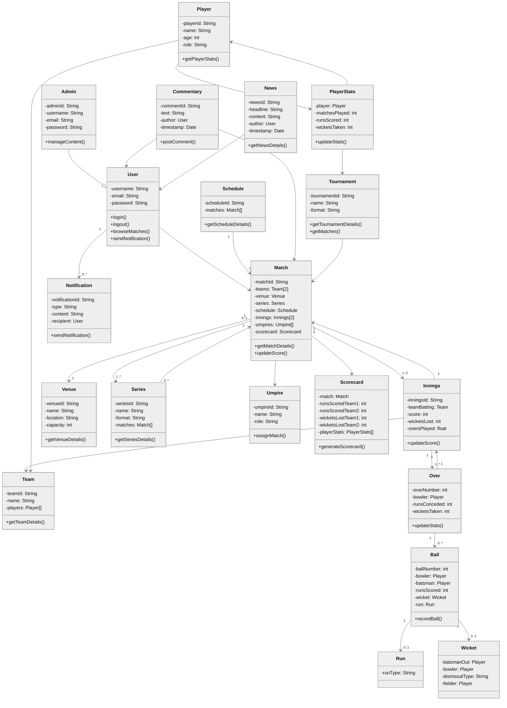

**Table of Contents**

- [System Requirements](#system-requirements)
- [Class diagram](#class-diagram)
- [Activity diagrams](#activity-diagrams)
- [Code](#code)

### System Requirements
- The system should be able to track the stats of all players, teams, and matches.
- The system should be able to track all scores or wickets that occurred for each ball. The system should also provide a live commentary for every ball.
- The system should be able to keep track of all matches—Test, T20, and ODI matches.
- The system should be able to keep track of ongoing and previous tournaments. The system should also be able to show a points table for all teams participating in a tournament.
- The system should be able to show the result of all previous televised matches.
- All teams should select some players who will participate in the tournament known as the tournament squad.
- For every match, the teams should be able to select 11 players to play on the field from the tournament squad, known as the playing eleven.
- The admin of the system should be able to add tournaments, matches, teams, players, and news to the system.

### Class diagram
------------

