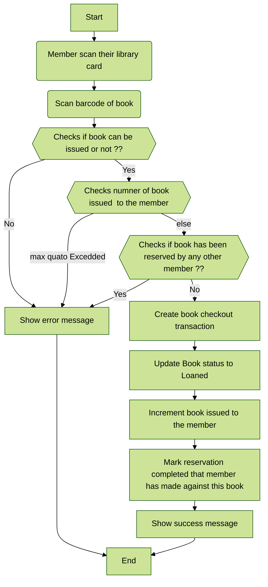
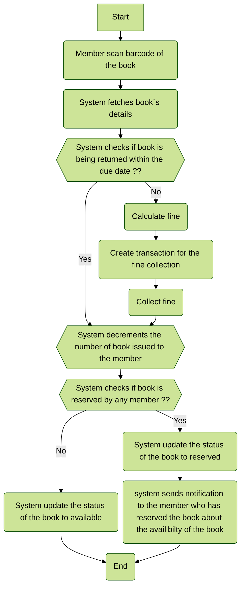
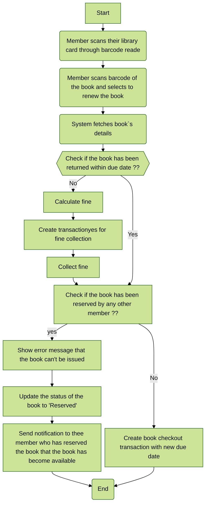

## Library Management System


**Table of Contents**

- [System Requirements](https://github.com/hillaryfraley/jobbriefings#purpose)
- [Use case diagram](https://github.com/hillaryfraley/jobbriefings#scope)
- [Class diagram](https://github.com/hillaryfraley/jobbriefings#work-practice)
- [Activity diagrams](https://github.com/hillaryfraley/jobbriefings#daily-briefing)
- [Code](https://github.com/hillaryfraley/jobbriefings#daily-briefing)

### System Requirements

- Any library member should be able to search books by their title, author, subject category as well by the publication date.
- Any library member should be able to search books by their title, author, subject category as well by the publication date.
- Each book will have a unique identification number and other details including a rack number which will help to physically locate the book.
- There could be more than one copy of a book, and library members should be able to check-out and reserve any copy. We will call each copy of a book, a book item.
- The system should be able to retrieve information like who took a particular book or what are the books checked-out by a specific library member.
- There should be a maximum limit (5) on how many books a member can check-out.
- There should be a maximum limit (10) on how many days a member can keep a book.
- The system should be able to collect fines for books returned after the due date.
- Members should be able to reserve books that are not currently available.
- The system should be able to send notifications whenever the reserved books become available, as well as when the book is not returned within the due date.
- Each book and member card will have a unique barcode. The system will be able to read barcodes from books and members library cards.

### Use case diagram
------------


### Class diagram
------------


### Activity diagrams
------------

####  Book checkout 

#### Return a book

#### Renew a book


### Code

------------


 Below is the code for book checkout, book return and book renew.
 
 > ***Note => In below code the database implementation and payment implementation are skiped.***
 
 ###### Enums and Constants
 
 
 ```python
from abc import ABC
from enum import Enum
from dataclasses import dataclass

class BookFormat(Enum):
    HARDCOVER, PAPERBACK, AUDIO_BOOK, EBOOK, NEWSPAPER, MAGAZINE, JOURNAL = 1, 2, 3, 4, 5, 6, 7

class BookStatus(Enum):
    AVAILABLE, RESERVED, LOANED, LOST = 1, 2, 3, 4

class ReservationStatus(Enum):
    WAITING, PENDING, CANCELED, NONE = 1, 2, 3, 4

class AccountStatus(Enum):
    ACTIVE, CLOSED, CANCELED, BLACKLISTED, NONE = 1, 2, 3, 4, 5

@dataclass
class Address:
    street_address: str 
    city: str
    state: str
    zip_code: int
    country: str   

@dataclass
class Person(ABC):
    name: str 
    address: Address
    email: str
    phone: str  

@dataclass
class Constants:
    MAX_BOOKS_ISSUED_TO_A_USER: int = 5
    MAX_LENDING_DAYS: int = 10

```


