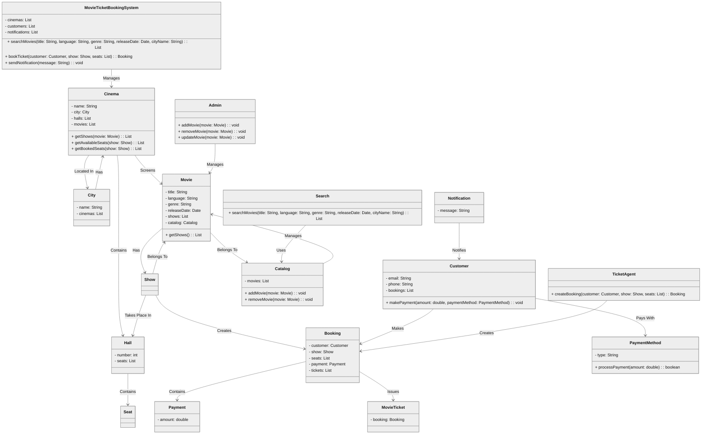

**Table of Contents**

- [System Requirements](#system-requirements)
- [Class diagram](#class-diagram)
- [Customer searches for a movie](#customer-searches-for-a-movie)
- [Code](#code)

### System Requirements
- It should be able to list the cities where affiliate cinemas are located.
- Each cinema can have multiple halls and each hall can run one movie show at a time.
- Each Movie will have multiple shows.
- Customers should be able to search movies by their title, language, genre, release date, and city name.
- Once the customer selects a movie, the service should display the cinemas running that movie and its available shows.
- The customer should be able to select a show at a particular cinema and book their tickets.
- The service should show the customer the seating arrangement of the cinema hall. The customer should be able to select multiple seats according to their preference.
- The customer should be able to distinguish between available seats and booked ones.
- The system should send notifications whenever there is a new movie, as well as when a booking is made or canceled.
- Customers of our system should be able to pay with credit cards or cash.
- The system should ensure that no two customers can reserve the same seat.
- Customers should be able to add a discount coupon to their payment.


### Class diagram
------------


------------
#### Customer searches for a movie

```mermaid

%%{init: { "theme": "forest","flowchart": {"nodeSpacing":10, "rankSpacing":20,"curve": "basic","useMaxWidth":true}} }%%
flowchart TD;
    START[Start]
    END[END]

    A(Customer searches for a movie);

    subgraph Options;
    B(By title);
    C(By language);
    D(By genre);
    E(By release date);
    end
    
    F{{Is movie available ?}};
    G(Inform customer of the availability);
    H(Customer selects an available show);
    I(Customer selects an available seat type);

    subgraph Seat;
    J(Silver);
    K(Gold);
    L(Platinum);
    end
    
    M(Customer selects a payment method);

    subgraph Payment;
    N(Customer inserts credit card);
    O(Customer pays cash);
    end
    
    P{{Transaction is successfull ? }};
    Q(System sends a success message);
    R(Customer receives the movie ticket);

    START--> A --> Options -->F;
    F -->|No| G;
    F -->|Yes| H;
    H --> I;
    I --> Seat--> M;
    M --> Payment --> P;
    P -->|No| M;
    P -->|Yes| Q --> R -->END;

    classDef se fill:#FDFCFC, color:#283747,stroke:#6F6A68,stroke-width:2px;
    classDef normal fill:#FDFCFC, color:#283747,stroke:#6F6A68,stroke-width:1px;
    classDef question fill:#FDFCFC, color:#283747,stroke:#283747,stroke-width:1.5px,stroke-dasharray:3;
    classDef success fill:#FDFCFC, color:#73C6B6,stroke:#283747;
    classDef error fill:#FDFCFC, color:#EC7063 ,stroke:#283747;

    class START,END se;
    class A,G,H,I,P,R,N,O,Q,M,B,C,D,E,J,K,L normal
    class F,P,Options,Seat,Payment question
    class G error
    class Q success
    
 ```

 ### Code
------------
 
 > ***Note => In below code the database implementation and payment implementation are skiped.***

 ```python

 from dataclasses import dataclass
from abc import ABC, abstractmethod
from typing import List

# Single Responsibility Principle (SRP): Each class has a single responsibility.

@dataclass
class Seat:
    number: int
    is_booked: bool = False

@dataclass
class ShowTime:
    start_time: str
    end_time: str

@dataclass
class Hall:
    number: int
    seats: List[Seat]

@dataclass
class Cinema:
    name: str
    city: str
    halls: List[Hall]
    movies: List["Movie"]

@dataclass
class City:
    name: str
    cinemas: List[Cinema]

@dataclass
class Movie:
    title: str
    language: str
    genre: str
    release_date: str
    shows: List[ShowTime]
    catalog: "Catalog"

@dataclass
class MovieTicket:
    booking: "Booking"

@dataclass
class Payment:
    amount: float

@dataclass
class Person:
    name: str

@dataclass
class Customer(Person):
    email: str
    phone: str
    bookings: List["Booking"]

    def make_payment(self, amount: float, payment_method: "PaymentMethod") -> bool:
        return payment_method.process_payment(amount)

@dataclass
class Admin(Person):
    def add_movie(self, movie: Movie, catalog: "Catalog"):
        catalog.add_movie(movie)

    def remove_movie(self, movie: Movie, catalog: "Catalog"):
        catalog.remove_movie(movie)

    def update_movie(self, movie: Movie, catalog: "Catalog"):
        catalog.update_movie(movie)

@dataclass
class TicketAgent(Person):
    def create_booking(self, customer: Customer, show_time: ShowTime, seats: List[Seat]) -> "Booking":
        booking = Booking(customer, show_time, seats)
        customer.bookings.append(booking)
        return booking

@dataclass
class Notification:
    message: str

@dataclass
class Catalog:
    movies: List[Movie]

    def add_movie(self, movie: Movie):
        self.movies.append(movie)

    def remove_movie(self, movie: Movie):
        self.movies.remove(movie)

    def update_movie(self, movie: Movie):
        for i, m in enumerate(self.movies):
            if m.title == movie.title:
                self.movies[i] = movie

@dataclass
class Search:
    @staticmethod
    def search_movies(catalog: Catalog, title: str, language: str, genre: str, release_date: str, city_name: str) -> List[Movie]:
        filtered_movies = []
        for movie in catalog.movies:
            if (not title or title.lower() in movie.title.lower()) and \
               (not language or language.lower() == movie.language.lower()) and \
               (not genre or genre.lower() == movie.genre.lower()) and \
               (not release_date or release_date.lower() == movie.release_date.lower()) and \
               (not city_name or any(cinema.city.lower() == city_name.lower() for cinema in movie.catalog.cinemas)):
                filtered_movies.append(movie)
        return filtered_movies

@dataclass
class Booking:
    customer: Customer
    show_time: ShowTime
    seats: List[Seat]

@dataclass
class PaymentMethod(ABC):
    @abstractmethod
    def process_payment(self, amount: float) -> bool:
        pass

@dataclass
class CreditCardPayment(PaymentMethod):
    def process_payment(self, amount: float) -> bool:
        # Implement credit card payment logic
        return True

@dataclass
class CashPayment(PaymentMethod):
    def process_payment(self, amount: float) -> bool:
        # Implement cash payment logic
        return True


 ```
