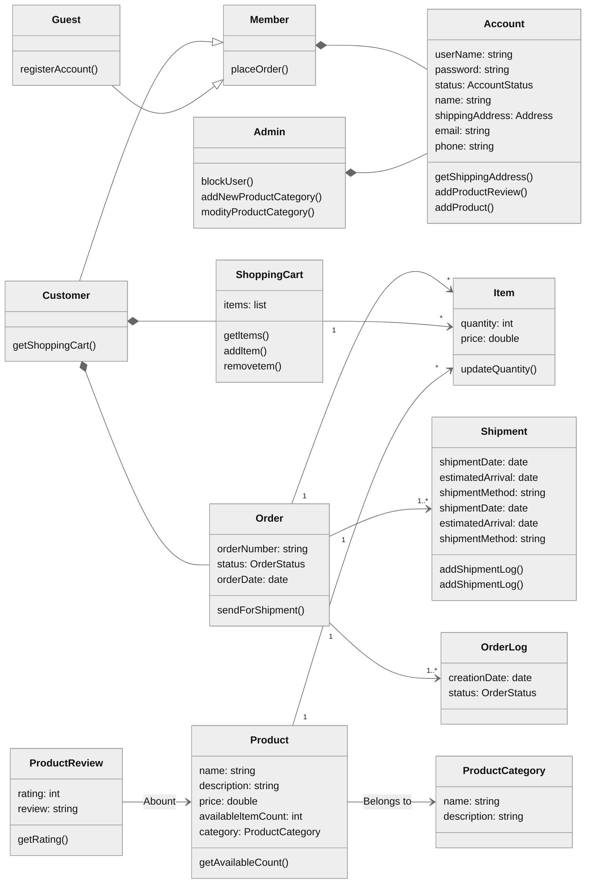

**Table of Contents**

- [System Requirements](#system-requirements)
- [Class diagram](#class-diagram)
- [Activity diagrams](#activity-diagrams)
- [Code](#code)

### System Requirements
- Users should be able to add new products to sell.
- Users should be able to search for products by their name or category.
- Users can search and view all the products, but they will have to become a registered member to buy a product.
- Users should be able to add/remove/modify product items in their shopping cart.
- Users can check out and buy items in the shopping cart.
- Users can rate and add a review for a product.
- The user should be able to specify a shipping address where their order will be delivered.
- Users can cancel an order if it has not shipped.
- Users should get notifications whenever there is a change in the order or shipping status.
- Users should be able to pay through credit cards or electronic bank transfer.
- Users should be able to track their shipment to see the current state of their order.

### Class diagram
------------

