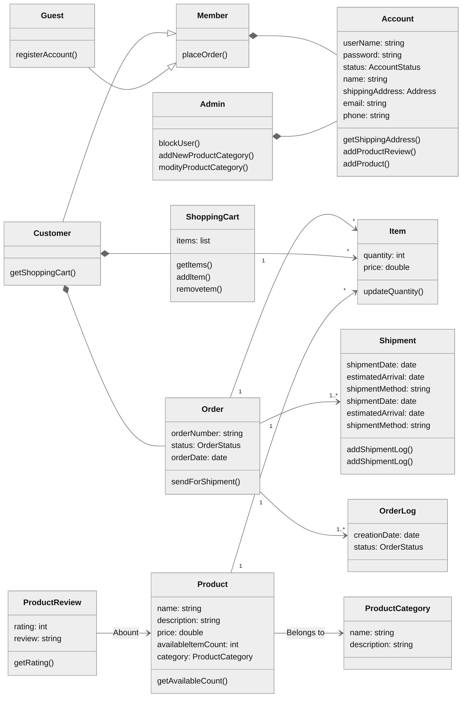

**Table of Contents**

- [System Requirements](#system-requirements)
- [Class diagram](#class-diagram)
- [Activity diagrams](#activity-diagrams)
- [Sequence diagrams](#sequence-diagrams)
- [Code](#code)

### System Requirements
- Users should be able to add new products to sell.
- Users should be able to search for products by their name or category.
- Users can search and view all the products, but they will have to become a registered member to buy a product.
- Users should be able to add/remove/modify product items in their shopping cart.
- Users can check out and buy items in the shopping cart.
- Users can rate and add a review for a product.
- The user should be able to specify a shipping address where their order will be delivered.
- Users can cancel an order if it has not shipped.
- Users should get notifications whenever there is a change in the order or shipping status.
- Users should be able to pay through credit cards or electronic bank transfer.
- Users should be able to track their shipment to see the current state of their order.

### Class diagram
------------


### Activity diagrams

------------
#### Activity diagram for a user

```mermaid

%%{init: { "theme": "forest","flowchart": {"nodeSpacing":10, "rankSpacing":20,"curve": "basic","useMaxWidth":true}} }%%
flowchart TD
    A[Start] --> B
    B(Customer open online shopping website) --> C(Customer browses products) 
    D{{Find Product ??}}
    E(View product)
    F(Search product) 
    G{{Find product in search ??}}
    H(Add product to cart)
    I{{More shopping ??}}
    J(View shopping cart)
    K{{Update shopping cart ??}}
    M(Update the shopping cart)
    L(checkout)
    Z(End)

    C --> D
    D -->|Yes| E
    D --> |No| F
    F --> G --> |Item found| E
    G --> |Item not found| F
    E --> H --> I
    I -->|Yes| C
    I -->|No| J --> K
    K --> |No| L -->Z
    K --> |Yes|M --> J 
    
    
    classDef se fill:#FDFCFC, color:#283747,stroke:#6F6A68,stroke-width:2px
    classDef normal fill:#FDFCFC, color:#283747,stroke:#6F6A68,stroke-width:1px
    classDef question fill:#FDFCFC, color:#283747,stroke:#283747,stroke-width:1.5px,stroke-dasharray:3
    classDef success fill:#FDFCFC, color:#73C6B6,stroke:#283747
    classDef error fill:#FDFCFC, color:#EC7063 ,stroke:#283747
    class A,Z se
    class B,C,E,F,H,J,L,M normal
    class D,G,I,K question
    linkStyle 0,1,2,3,5,6,8,9,10,11,12,13,14,15,16 stroke:#6F6A68,stroke-width:1.2px,color:#6F6A68
    linkStyle 4,7 stroke:#F3A8A0,stroke-width:1.1px,color:#973126
    
 ```
 
### Sequence diagrams

------------

#### sequence diagram for product search
```mermaid

%%{init: { "theme": "neutral"} }%%
sequenceDiagram
    actor A as customer
    participant C as Catlog
    participant P as Product
    A->>C: searchProducts(string)
    C->>P: getInfo(string)
    P-->>C: Full Product Info
    C-->>A: Matching Products Info
    
 ```
 
 ### Code
------------
 
 > ***Note => In below code the database implementation and payment implementation are skiped.***
 
 ###### Enums and Constants
 
 ```python
 from enum import Enum
from dataclasses import dataclass


class OrderStatus(Enum):
  UNSHIPPED, PENDING, SHIPPED, COMPLETED, CANCELED, REFUND_APPLIED = 1, 2, 3, 4, 5, 6


class AccountStatus(Enum):
  ACTIVE, BLOCKED, BANNED, COMPROMISED, ARCHIVED, UNKNOWN = 1, 2, 3, 4, 5, 6


class ShipmentStatus(Enum):
  PENDING, SHIPPED, DELIVERED, ON_HOLD = 1, 2, 3, 4


class PaymentStatus(Enum):
  UNPAID, PENDING, COMPLETED, FILLED, DECLINED, CANCELLED, ABANDONED, SETTLING, SETTLED, REFUNDED = 1, 2, 3, 4, 5, 6, 7, 8, 9, 10

@dataclass
class Address:
    street_address: str
    city: str
    state: str
    zip_code: int
    country:str
 ```
 
###### Account, Customer, Admin, and Guest
 
 ```python
from dataclasses import dataclass, field
from abc import ABC


@dataclass
class Address:
   street_address: str
   city: str
   state: str
   zip_code: int
   country:str
  
@dataclass
class Account:
    username: str
    password: str
    name: str
    email: str
    phone: str
    shipping_address : Address
    status: AccountStatus = AccountStatus.ACTIVE
    credit_cards : list = field(default_factory=list) 
    bank_accounts : list = field(default_factory=list)
      
    
    def add_product(self, product):
      None
  
    def add_productReview(self, review):
      None
  
    def reset_password(self):
      None

@dataclass
class Customer(ABC):
    cart : list = field(default_factory=list)
    order : list = field(default_factory=list)
  
    def get_shopping_cart(self):
      return self.__cart
  
    def add_item_to_cart(self, item):
      None
  
    def remove_item_from_cart(self, item):
      None
  
class Guest(Customer):
    def register_account(self):
      None


class Member(Customer):
    def __init__(self, account):
      self.__account = account

    def place_order(self, order):
      None


```

###### ProductCategory, Product, and ProductReview
 
 ```python
from dataclasses import dataclass, field
from abc import ABC

@dataclass
class ProductCategory :
  name: str
  description: str

@dataclass
class Product:
    product_id: int
    name : str
    description: str
    price: float
    category: ProductCategory
    available_item_count: int = 0

@dataclass
class ProductReview:
    rating: int
    review: str
    product = Product
    reviewer = Member

```
###### Shipment, ShipmentLog, and Notification
 
 ```python
from dataclasses import dataclass, field
from abc import ABC
import datetime.datetime 

@dataclass
class ShipmentLog:
    shipment_number: int
    status: ShipmentStatus = ShipmentStatus.PENDING
    creation_date = datetime.date = datetime.date.today()


class Shipment:
    shipment_number: int
    shipment_method: str
    shipment_date: datetime.date = datetime.date.today()
    estimated_arrival: datetime.date = datetime.date.today()
    shipmentLogs : list = field(default_factory=list)
    def add_shipment_log(self, shipment_log):
      None

@dataclass
class Notification(ABC):
    notification_id: int
    content: str
    created_on : datetime.date = datetime.date.today()
 
    def send_notification(self, account):
      None

```
 
