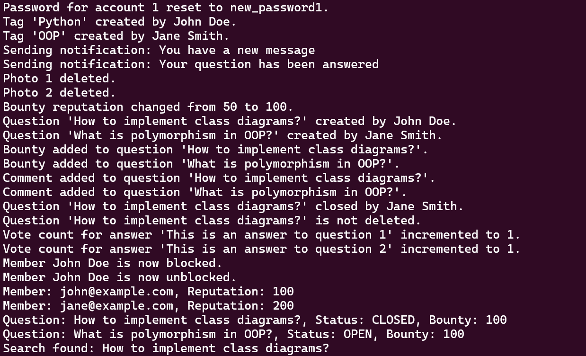

# Stack Overflow System

This project implements a comprehensive Question and Answer (Q&A) system in Python using an object-oriented design. The system includes user roles, questions, answers, comments, tags, badges, notifications, and more.

## Project Structure


### Description of Folders and Files

- **`enums`**: This directory contains all the enumeration types used in the project, such as account status and question status.
    - **`__init__.py`**: Makes the `enums` directory a package.
    - **`account_status.py`**: Defines the `AccountStatus` enum which includes various statuses for user accounts.
    - **`question_status.py`**: Defines the `QuestionStatus` enum for different question statuses.
    - **`question_closing_remark.py`**: Defines `QuestionClosingRemark` enum to categorize reasons for closing questions.

- **`models`**: This directory contains all the data models representing different components of the Q&A system.
    - **`__init__.py`**: Makes the `models` directory a package.
    - **`account.py`**: Contains the `Account` class, representing user accounts.
    - **`member.py`**: Contains the `Member` class, extending `Account` with specific member functionalities.
    - **`admin.py`**: Contains the `Admin` class, providing admin-specific actions.
    - **`moderator.py`**: Contains the `Moderator` class, enabling moderation capabilities.
    - **`badge.py`**: Contains the `Badge` class, representing user achievements.
    - **`tag.py`**: Contains the `Tag` class for question categorization.
    - **`notification.py`**: Contains the `Notification` class for user notifications.
    - **`photo.py`**: Contains the `Photo` class for handling user-uploaded photos.
    - **`bounty.py`**: Contains the `Bounty` class for managing question bounties.
    - **`question.py`**: Contains the `Question` class, representing questions in the system.
    - **`comment.py`**: Contains the `Comment` class, representing comments on questions and answers.
    - **`answer.py`**: Contains the `Answer` class, representing answers to questions.

- **`main.py`**: The main script that ties everything together. Running this script demonstrates how the various classes and methods interact in a typical usage scenario.

## How to Run

### Prerequisites

- Python 3.7 or above must be installed on your system.

### Run the Project
```bash
    python3 main.py
```

Running this command will execute the `main.py` script, which demonstrates the functionality of the system by creating instances of various classes, performing operations, and printing outputs to the console.

#### Screenshot


