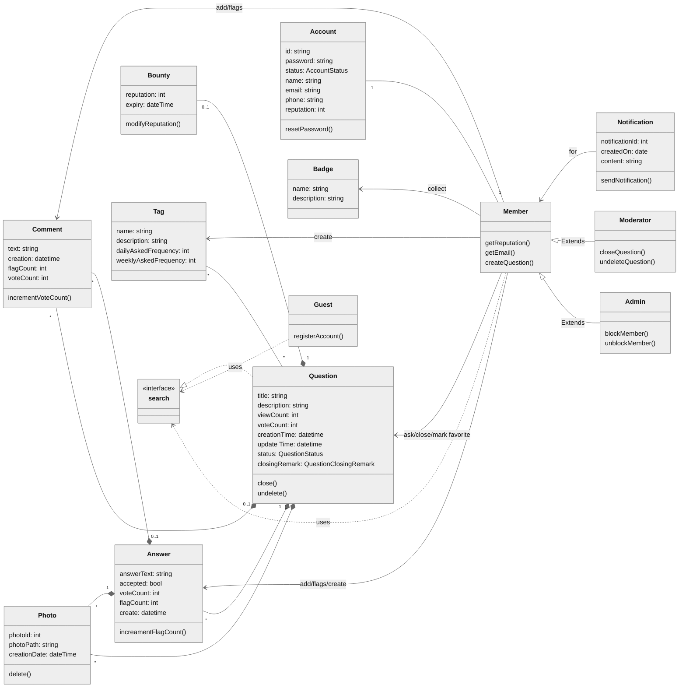

## Stack Overflow

**Table of Contents**

- [System Requirements](#system-requirements)
- [Use case diagram](#use-case-diagram)
- [Class diagram](#class-diagram)
- [Activity diagrams](#activity-diagrams)
- [Code](#code)

### System Requirements
- Any non-member (guest) can search and view questions. However, to add or upvote a question, they have to become a member.
- Members should be able to post new questions.
- Members should be able to add an answer to an open question.
- Members can add comments to any question or answer.
- A member can upvote a question, answer or comment.
- Members can flag a question, answer or comment, for serious problems or moderator attention.
- Any member can add a bounty to their question to draw attention.
- Members will earn badges for being helpful.
- Members can vote to close a question; Moderators can close or reopen any question.
- Members can add tags to their questions. A tag is a word or phrase that describes the topic of the question.
- Members can vote to delete extremely off-topic or very low-quality questions.
- Moderators can close a question or undelete an already deleted question.
- The system should also be able to identify most frequently used tags in the questions.

### Class diagram
------------

